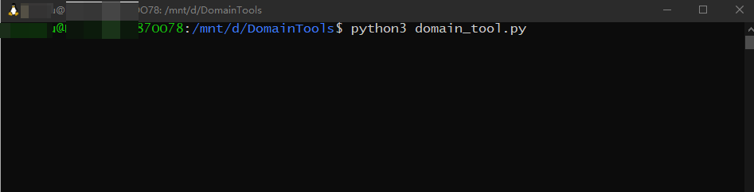
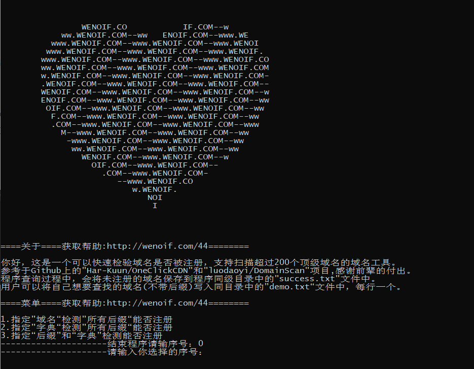
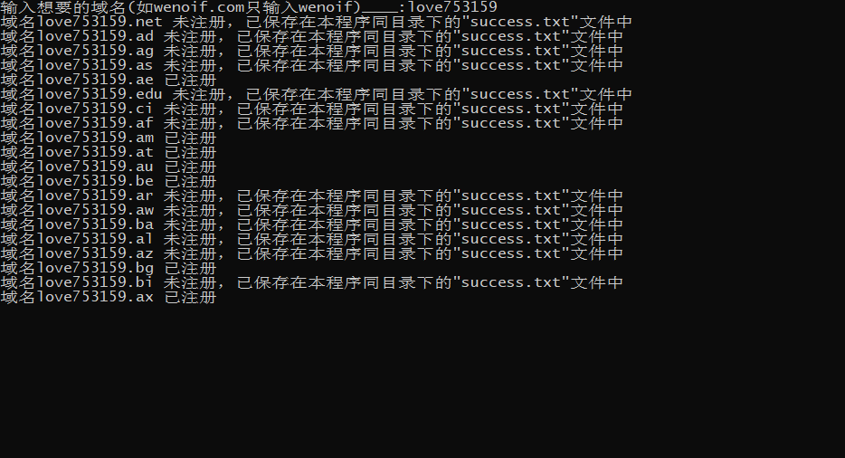
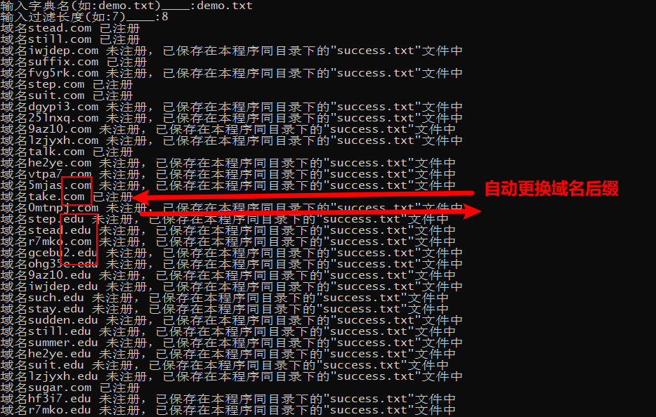
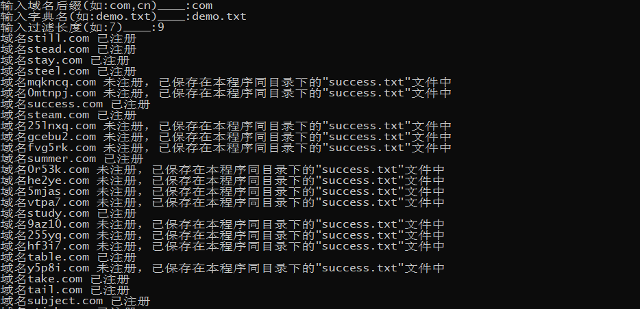
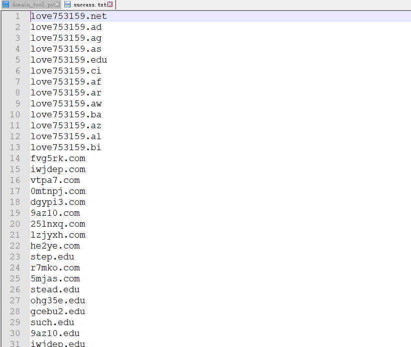
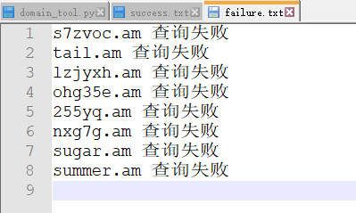

## 声明

> 本项目在“[DomainMegaBot](https://github.com/Har-Kuun/DomainMegaBot)”和“[DomainScan](https://github.com/luodaoyi/DomainScan)”开源项目上进行了修改和拓展。
>
> 本项目Github地址：[github.com/wenoif/DomainTools](https://github.com/wenoif/DomainTools)
>
> 本项目使用说明地址：[wenoif.com/44](https://wenoif.com/44)
>
> ：）转载请注明本文地址

## 简介

> 功能：
>
> + 扫描200多个顶级域名有没有被注册
>
> 语言：
>
> + 扫描工具：python 3
> + 字典生成：C语言
>
> 方式：
>
> + 自定义前缀批量扫描域名
> + 自定义后缀批量扫描前缀
> + 自定义导入字典扫描指定域名后缀
> + 自定义导入字典批量扫描域名后缀
>
> 附件：
>
> + 附带20个字典库
>   + 1-5位的“数字”全排列
>   + 1-5位的“数字+特殊符号”全排列
>   + 1-4位的“字母”全排列
>   + 1-4位的“字母+特殊符号”全排列
>   + 2-4位的“数字+字母”全排列
>   + 2-4位的“数字+字母+特殊符号”全排列
>   + 37W个英文单词(不含连字符)
>   + 46W个英文单词(含连字符)
> + 附带字典生成程序
>   + 1-5位“字母”全排列（分为含连字符、不含连字符）
>   + 1-5位“数字”全排列（分为含连字符、不含连字符）
>   + 1-4为“数字+字母”全排列（分为含连字符、不含连字符）
>
> 

## 说明

> + creat字典生成程序
>
>   > 1-0pl3/4.c：10个数字全排带-符号3/4位
>   >
>   > 2-6pl3/4.c：26个字母全排带-符号3/4位
>   >
>   > 3-6pl3/4.c：126个字母+10个数字全排带-符号3/4位
>   >
>   > 10pl1.c----10pl5.c：10个数字全排1-5位
>   >
>   > 26pl1.c----26pl5.c：26个字母全排1-5位
>   >
>   > 36pl1.c----36pl5.c：26个字母+10个数字全排1-5位
>
> + dic字典库
>
>   > **1-0+2-6+3-6pl4.txt:4位以内带符号的所有全排**
>   >
>   > 1-0pl3/4.txt：10个数字全排带-符号3/4位
>   >
>   > 2-6pl3/4.txt：26个字母全排带-符号3/4位
>   >
>   > 3-6pl3/4.txt：126个字母+10个数字全排带-符号3/4位
>   >
>   > **10+26+36pl4.txt:4位以内的“数字+字母”所有全排**
>   >
>   > 10pl1+2+3+4+5.txt：10个数字全排1-5位
>   >
>   > 26pl1.txt----26pl4.txt：26个字母全排1-4位
>   >
>   > 26pl1+2+3+4.txt：26个字母全排1-4位
>   >
>   > 36pl2+3.txt：36个字母+10个数字全排2-3位
>   >
>   > 36pl2.txt----36pl4.txt：36个字母+10个数字全排2-4位
>   >
>   > **all1+2+3.txt：所有的1位2位3位组合**
>   >
>   > words_and-:46W个英文单词(含连字符)
>   >
>   > words_no-:37W个英文单词(不含连字符)
>
> + data数据库
>
>   > 笔者进行扫描后的数据
>
> + **demo.txt**  测试字典
>
> + **domain_tool.py**  扫描工具
>
> + **domain_tool_comment.py** 扫描工具(含详细注释)
>
> + **README.MD** 说明文件
>
> + **top_level_domain_name_suffix** 顶级域名后缀数据
>
> + **success.txt** 保存扫描成功没被注册的域名
>
> + **failure.txt** 保存扫描失败的域名

##  运行

> 1. `python3 domain_tool.py`
> 2. 选择相应的功能
> 3. 如果使用字典库，需要将想要使用的字典复制到扫描工具的同级目录下
> 4. 用户可以在**demo.txt** 修改自己想要扫描的域名前缀
> 5. 用户可以在扫描工具的同级目录下新建字典，字典不需要带后缀(.com  .xyz等)

## 使用

>  ：）技术能力有限，功能尚不完善，还请多多包涵。

## 感谢

> + 感谢[Har-Kuun](https://github.com/Har-Kuun)的“[DomainMegaBot](https://github.com/Har-Kuun/DomainMegaBot)”项目
> + 感谢[luodaoyi](https://github.com/luodaoyi)的“[DomainScan](https://github.com/luodaoyi/DomainScan)”项目
> + 单词字典下载于网络，感谢网络
> + 心形代码下载于网络，感谢网络

## 域名推荐

+ [国内服务商:阿里云 （原万网）](https://www.aliyun.com/minisite/goods?userCode=pdvz8axd)

  > 提供智能查询，快速安全的域名注册服务，支持国际、国内、国别等数十种丰富的域名种类供您选择。目前已超过2000万个域名在阿里云注册，连续20年蝉联国内域名市场NO.1。
  >
  > [领券页面](https://www.aliyun.com/minisite/goods?userCode=pdvz8axd)	
  > [购买页面](https://www.aliyun.com/minisite/goods?userCode=pdvz8axd)

+ [国外服务商:NameSilo](https://www.namesilo.com/?rid=8736b96bt)

  > Namesilo 是目前价格较便宜的国外域名平台。它支持支付宝、Paypal、Visa 等多种付款方式，还可以免费使用域名隐私保护，100个域名邮箱，性价比非常之高。
  >
  > [官网首页](https://www.namesilo.com/?rid=8736b96bt)	
  > [域名页面](https://www.namesilo.com/register.php?rid=8736b96bt)	
  > [定价页面](https://www.namesilo.com/pricing?rid=8736b96bt)	
  > 优惠代码:**“namesiloeoffer”**（可以抵扣1美元，约7元人民币）

+  [更多优惠推荐](https://wenoif.com/42)

